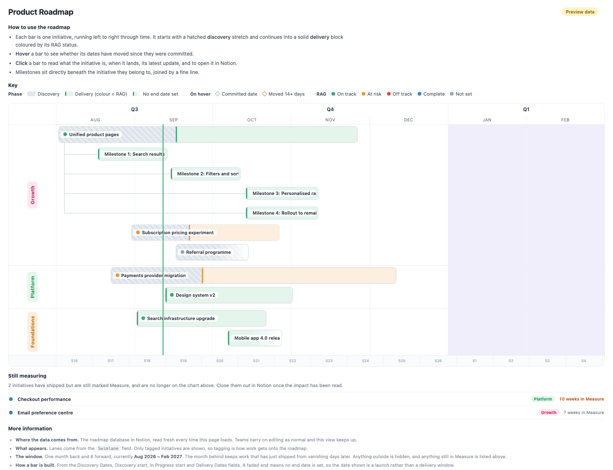

# Notion roadmap

A swimlane roadmap that draws itself from a Notion database, and keeps working when
someone renames a property.



Most "Notion to a chart" scripts break the first time a property is renamed or retyped,
because the field names are scattered through the code. This one treats Notion as an
untrusted source and puts every assumption about it in one config file. A rename becomes a
config edit, not an outage — and anything it cannot place is reported on the page instead
of silently disappearing.

Built for a product org's quarterly roadmap, then genericised. The sample data is
fictional.

## What it gives you

- **A rolling window** — one month back, six forward — with initiatives laid out in
  swimlanes, split into a discovery lead-in and a delivery block, coloured by RAG.
- **Milestones nested under their parent**, joined by a connector, using Notion's own
  sub-item relation.
- **Slippage you can trust.** If an initiative has a committed date, the view shows how far
  the current landing has moved from it. Committed dates that were *copied* rather than
  committed — the thing that happens when you duplicate a milestone — are detected and
  excluded, with the reason shown on hover.
- **A detail card on click**: what the initiative is, when it lands, its latest update, and
  a link through to the Notion page.
- **A nudge list** for work that shipped but was left in Measure.
- **Data-quality notes** on the page: how many initiatives have no RAG, how many carry a
  committed date that looks copied.

## The idea worth stealing

Even if you never run this, `roadmap-app/mapping.json` is the part to look at.

```jsonc
"fields": {
  "swimlane": { "notion": "Swimlane", "type": "select",
                "aliases": ["Lane", "Workstream", "Category"] }
}
```

Every Notion property name lives there, with fallback aliases. The adapter reads each
field tolerantly, so a property retyped from a select to plain text still yields a value.
If a field cannot be found at all, the page shows a warning naming the property and what
to edit — rather than rendering an empty chart and letting you assume the quarter is empty.

That one file is the difference between a view that rots and one that doesn't.

## Getting started

```bash
git clone https://github.com/YOUR-USERNAME/notion-roadmap.git
cd notion-roadmap/roadmap-app
open index.html          # renders the fictional demo data, no setup needed
```

To point it at your own Notion database, see **[SETUP.md](SETUP.md)**. It takes about ten
minutes and needs no build step, no framework and no dependencies.

## What is in here

| Path | What it is |
|---|---|
| `roadmap-app/` | The page, the Notion adapter, and a tiny Node server. No dependencies. |
| `roadmap-app/mapping.json` | Every assumption about your Notion schema, in one file. |
| `roadmap-app/notion.js` | `adapt()` — turns Notion pages into the view's internal shape. |
| `roadmap-claude/` | An optional route that publishes the roadmap as a live page inside Claude, so people can refresh it themselves without running a server. |
| `roadmap-app/test-adapter.js` | 38 checks covering schema drift, renamed fields, retyped fields and the committed-date rules. |

## Running the tests

There is no test framework. The adapter suite runs under JavaScriptCore, which ships with
macOS, or under Node:

```bash
cd roadmap-app
/System/Library/Frameworks/JavaScriptCore.framework/Versions/A/Helpers/jsc test-adapter.js
```

They feed deliberately broken Notion payloads through the adapter — renamed properties,
retyped fields, missing dates, garbage rows — and assert it degrades to a warning rather
than a crash.

## Licence

MIT. Use it, change it, ship it. No warranty.
